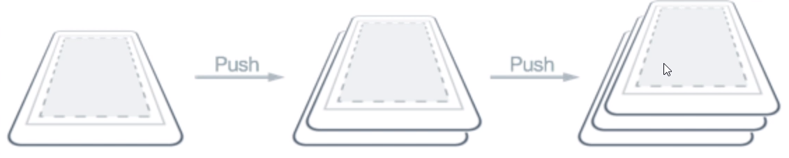
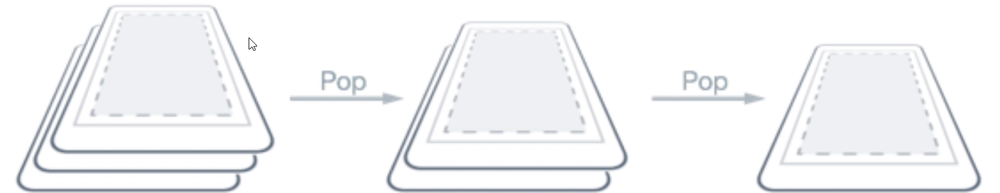
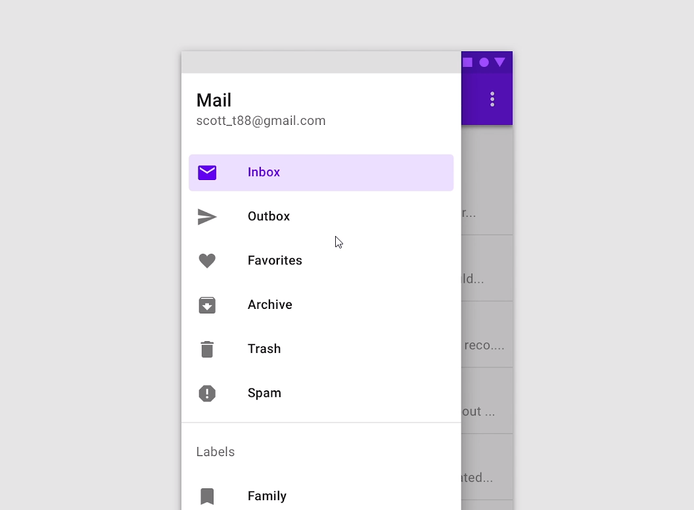

# Páginas

Existen diferentes tipos de página en MAUI
* Content Page
* Navigation Page
* Flyout Page
* Tabbed Page

## Página inicial en .net MAUI

Lo primero es saber donde se asigna nuestra pagina principal

* App.xaml
  * App.xaml.cs
    ```cs
    namespace PagesDemo
    {
        public partial class App : Application
        {
            public App()
            {
                InitializeComponent();

                MainPage = new AppShell();
            }
        }
    }
    ```

Nos indica que nuestra pagina de inicio sera la de AppShell, nosotros podemos cambiarla por ejemplo por la de MainPage
```cs
    namespace PagesDemo
    {
        public partial class App : Application
        {
            public App()
            {
                InitializeComponent();

                MainPage = new MainPage();
            }
        }
    }
```

## Content Page

Es la que mas se usan, ya que nos permite agregar diferentes elementos como StackLayout.

Es importante tener en cuenta de que los content page solo deben de tener de hijo a un solo elementos, no admite a mas hijos. (Ojo)

```xml
<?xml version="1.0" encoding="utf-8" ?>
<ContentPage xmlns="http://schemas.microsoft.com/dotnet/2021/maui"
             xmlns:x="http://schemas.microsoft.com/winfx/2009/xaml"
             x:Class="PagesDemo.ContentPageDemo"
             Title="ContentPageDemo">
    <VerticalStackLayout>
        <Label 
            Text="Welcome to .NET MAUI!"
            VerticalOptions="Center" 
            HorizontalOptions="Center" />
    </VerticalStackLayout>
</ContentPage>
```

## Navigation Page

La parte de la navegacion en importantante.



En un inicio tenemos nuestra primera pagina, y a medida que vayamos navegando hacia otras paginas lo que sucede es un apilamiento de estas páginas una tras otra.



Ahora si queremos navegar hacia una pagina anterior estas se iran quitando una a una de esa pila hasta llegar a la primera pagina.

En el code behind podemos usar:
```cs
Navigation.pushAsync(new ContentPageDemo());
Navigation.popAsync();
```

Antes de hacer funcionar, debemos crear esa pila de navegacion. o como realizaremos nuestra navegación.

esto se hace en el App.xaml.cs
```cs
MainPage = new NavigationPage(new MainPage());
```

> Recordar que siempre se maneja una pila de navegación, asi que si andamos navegando cada nueva pagina seran nuevas instancias

## FlyoutPage



Son las listas desplegables que aparecen en las aplicaciones.

Para crear un flyout page:
1. Agregar un nuevo elemento
2. Crear un Content Page
3. Una vez creado se tiene que sobreescribir el xaml que se creó por:
```xml
<?xml version="1.0" encoding="utf-8" ?>
<FlyoutPage xmlns="http://schemas.microsoft.com/dotnet/2021/maui"
             xmlns:x="http://schemas.microsoft.com/winfx/2009/xaml"
             x:Class="PagesDemo.FlyoutPageDemo"
             Title="FlyoutPageDemo">
    
    <FlyoutPage.Flyout>
        <ContentPage Title="My App">
            
        </ContentPage>
    </FlyoutPage.Flyout>
    
    <FlyoutPage.Detail>
        <ContentPage>
            
        </ContentPage>
    </FlyoutPage.Detail>
    
</FlyoutPage>
```
4. Y tambien deberiamos modificar en el code behind
```cs
namespace PagesDemo;

public partial class FlyoutPageDemo : FlyoutPage
{
	public FlyoutPageDemo()
	{
		InitializeComponent();
	}
}
```
En cuanto a la herencia ya no deberia heredar de ContentPage, sino deberia heredar de `FlyoutPage`


> Se tiene que revisar el `<Shell>` y revisar bien el FlyoutPage en YouTube

## Tabbed Page

Pagina basada en pestañas

> Revisar nueva documentacion porque no se esta mostrando segun el curso


