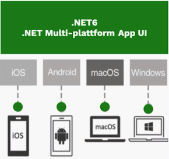
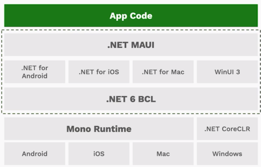
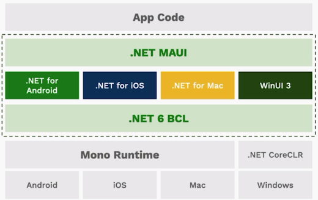
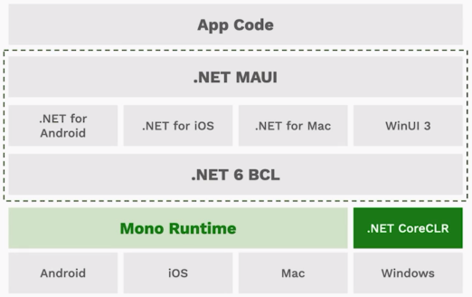
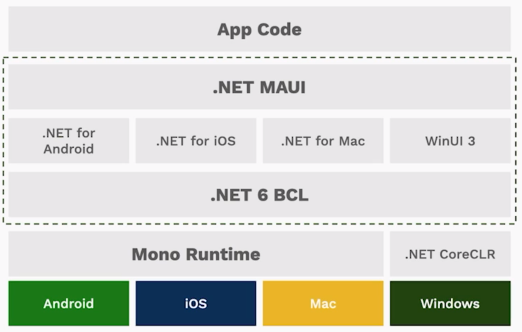
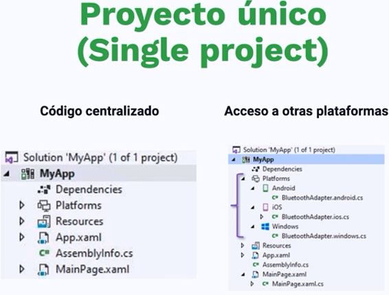
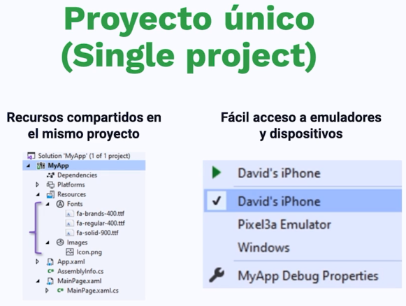
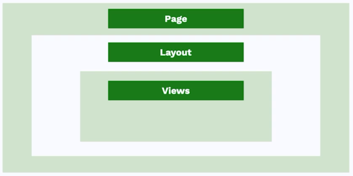
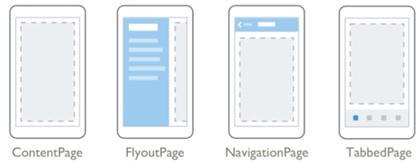

# CURSO DE .NET MAUI: Fundamentos 
* Introducción de .NET MAUI
* Conociendo el XAML y su estructura
* Profundizando en la estructura básica de un UI
  * Pages
  * Layouts
  * Controles
* Estilos

## Introducción a .NET MAUI



.NET Multi-platform App UI es un framework multiplataforma para crear aplicaciones móviles y de escritorio nativas con C# y XAML, es la evolución de Xamarin Forms

----


.NET MAUI se encarga de unificar las APIs de:

* Android
* iOS
* Mac
* WinUI 3
y luego se encarga de unificarla con el objetivo de que el compartimiento de codigo sea lo mas eficiente posible
----



.NET MAUI se encarga de otorgar un framework epecífico para cada una de estas plataformas, es decir tiene un framework para Android, iOS, MAC, Windows; todos estos si bien estan separados tienen acceso a la clase base .NET 6 que es `BCL`,

----



BCL se encarga de abstraer las partes mas importantes de todas las plataformas y luego se encarga de asignar un ambiente de ejecución a cada una de las plataformas, por ejemplo:
* Mono Runtime > Para Android, iOS, MAC
* .NET CoreCLR > Para Windows

----



Es importante es que si bien existe codigo compartido, si se tiene algun requerimiento individual se puede usar el framework de manera individual

## Breve Historia de Xamarin


## Proyecto único (Single Project)

Como es la estructura de un proyecto de .NET MAUI





## Conociendo XAML y su estructura

¿Qué es XAML?

e**X**tesible **A**pplication **M**arkup **L**anguage

**XAML** es un lenguaje basado en XML creado por Microsoft el cual permite a los desarrolladores definir interfaces de usuario en aplicaciones de Xamarin.Forms / .NET MAUI mediante marcado en lugar de código 

## Estructura básica del XAML



* Pages.- Son modelos predefinidos que la aplicación tendra, nosostros debemos seleccionar cual nos conviene
* Layouts.- Nos ayudan a agrupar nuestros componentes, tenemos diferentes tipos de layout, es obligatorio definir el primer layout que engloba todo
* Views.- O tambien llamados controles, botones, label nos ayudan a organizar esta comunicacion que tenemos con el usuario.

### Pages



* ContentPage.- Es una pagina en blanco el cual nos ayuda a estructurar todo nuestro layout como queramos.
* FlyoutPage.- Esta compuesto por dos páginas (menú) y (pagina) donde se desglosa los detalles de las opciones de este menú. 
* NavigationPage.- es una pagina en blanco pero se nos ayuda en la navegación en el UI.
* TabbedPage.- Nos ayuda a tabular la información, tabula de acuerdo a la platafoma un ejemplo es Instagram.

#### ContentPage

Es una página en blanco.

Estructura básica en codigo
```xml
<?xml version="1.0" encoding="utf-8" ?>
<ContentPage xmlns="http://schemas.microsoft.com/dotnet/2021/maui"
             xmlns:x="http://schemas.microsoft.com/winfx/2009/xaml"
             x:Class="_001ContentPage.MainPage">

    

</ContentPage>
```
#### FlyoutPage

Es el de los más usados, casi todas las aplicaciones lo implementan.

Cuenta con un menu y un contentPage


#### NavigationPage

Tambien es una de las mas usadas, cuenta con una navegacion simple (adelante, atras) y una pantalla

####
####

## LAYOUTS
----

### Stack Layout

Permite organizar nuestros Views en direccion horizontal y/o vertical

```xml
<?xml version="1.0" encoding="utf-8" ?>
<ContentPage xmlns="http://schemas.microsoft.com/dotnet/2021/maui"
             xmlns:x="http://schemas.microsoft.com/winfx/2009/xaml"
             x:Class="_001ContentPage.Views.Pages.StackLayoutt.NewPage1"
             Title="NewPage1">
    <VerticalStackLayout VerticalOptions="Center">
        <Frame CornerRadius="20" Margin="20" HeightRequest="320">
            <VerticalStackLayout>
                <Frame IsClippedToBounds="True" Padding="0" CornerRadius="10" HeightRequest="150" WidthRequest="150" HorizontalOptions="Start" Padding="0,0">
                    <Image Source="dotnet_bot.svg" Aspect="AspectFill"/>
                </Frame>
                <!--Detalle de perfil-->
                <Label Text="Jordan Amblin" FontAttributes="Bold" FontSize="22" Padding="0,20,0,0"/>
                <Label Text="he/him" TextColor="#7b7b7b" FontSize="20"/>
                <Label Text="Hey!! I'm Product Designer on the meeting experience team." FontAttributes="Bold" />

            </VerticalStackLayout>
        </Frame>
    </VerticalStackLayout>
</ContentPage>
```

### Absolute Layout

Implementa una función de posicionamiento y dimension de tamaño proporcional absoluto. Puede colocar elementos secundarios para que se superpongan.


